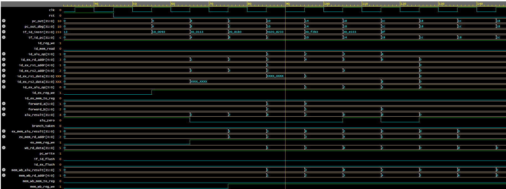

# RV32I Pipelined Processor

An upgrade of the single-cycle RV32I processor to a classic **5-stage pipeline** with full forwarding and hazard detection. Built on top of the verified single-cycle implementation — every existing module reused unchanged, with new pipeline infrastructure added around them.

> Single-cycle version lives on the `main` branch. This pipeline version is on the `pipeline` branch.

---

## Waveform

The waveform below shows the pipeline executing six back-to-back arithmetic instructions. The key signal to observe is `forward_a` and `forward_b` activating at exactly cycle 5 — the forwarding unit detecting RAW hazards and routing results directly to the ALU inputs with zero stall cycles.

 

### Reading the Waveform

```
Signal          Value Sequence          What It Proves
──────────────────────────────────────────────────────────────────
if_id_instr     NOP→ADDI→ADDI→ADD→     All 6 instructions fetched
                SUB→AND→OR→JAL          in correct order

alu_result      0→5→3→8→2→...          ADDI x1=5 ✅
                                        ADDI x2=3 ✅
                                        ADD  x3=8 ✅ (5+3, forwarded)
                                        SUB  x4=2 ✅ (5-3, forwarded)

forward_a       0→1→0                   MEM/WB→EX forward firing
                                        when ADD needs x1

forward_b       0→2→1→0                 EX/MEM→EX forward firing
                                        when ADD needs x2

ex_mem_reg_we   0→1→stays 1            No spurious write-enable drops

branch_taken    0 throughout            No false branch detection

if_id_flush     0 throughout            No spurious pipeline flushes
id_ex_flush     0 throughout

pc_write        1 throughout            No spurious stalls
```

The diagonal flow of `ex_mem_rd_addr` changing as `0→1→2→3→4→5→6` confirms each instruction (x1 through x6) flowing correctly through the MEM stage one per cycle — the pipeline running at full throughput.

---

## What Was Added

### 4 Pipeline Registers

| Module | Boundary | Key Signals Carried |
|--------|----------|---------------------|
| `IFID_pipeline_reg.v` | IF → ID | `instr`, `pc`, `pc_plus4` |
| `IDEX_pipeline_reg.v` | ID → EX | `rs1_data`, `rs2_data`, `immediate`, `pc`, `pc_plus4`, `rs1_addr`, `rs2_addr`, `rd_addr`, all control signals |
| `EXMEM_pipeline_reg.v` | EX → MEM | `alu_result`, `rs2_data`, `rd_addr`, `pc_plus4`, memory and WB control signals |
| `MEMWB_pipeline_reg.v` | MEM → WB | `alu_result`, `read_data`, `pc_plus4`, `rd_addr`, `reg_we`, `mem_to_reg` |

Each pipeline register carries **control signals alongside the instruction** so they arrive at the right stage at the right cycle — `mem_we` generated in ID reaches the data memory in MEM two cycles later, `reg_we` generated in ID reaches the register file in WB four cycles later.

### Forwarding Unit (`forwarding_unit.v`)

Resolves RAW (Read After Write) data hazards with **zero stall cycles** by bypassing the register file and routing results directly to the ALU inputs from earlier pipeline stages.

Two forwarding paths:

```
EX/MEM → EX  (1-cycle-old result)   forward = 2'b10
MEM/WB → EX  (2-cycle-old result)   forward = 2'b01
No forward   (register file value)   forward = 2'b00
```

Detection conditions (for ALU input A):
```verilog
// EX/MEM → EX (higher priority)
if (ex_mem_reg_we && ex_mem_rd != x0 && ex_mem_rd == id_ex_rs1)
    forward_a = 2'b10;

// MEM/WB → EX (lower priority)
else if (mem_wb_reg_we && mem_wb_rd != x0 && mem_wb_rd == id_ex_rs1)
    forward_a = 2'b01;
```

The `rd != x0` check prevents forwarding from instructions that write to the hardwired-zero register.

### Hazard Detection Unit (`hazard_unit.v`)

Handles two hazard types:

**Load-use hazard** — the one case forwarding cannot solve. When a load is immediately followed by an instruction using the loaded value, the data does not exist until after MEM but EX needs it at the start of that same cycle. Resolution: stall the pipeline for 1 cycle.

```verilog
load_use = id_ex_mem_read
        && id_ex_rd != x0
        && (id_ex_rd == if_id_rs1 || id_ex_rd == if_id_rs2)

PCWrite    = ~load_use    // freeze PC
IF_ID_write= ~load_use    // freeze IF/ID register
ID_EX_flush=  load_use    // insert bubble into EX
```

**Branch flush** — when a branch is taken, two wrongly-fetched instructions must be killed:

```verilog
IF_ID_flush = branch_taken    // kill instruction in ID
ID_EX_flush = branch_taken    // kill instruction in EX
```

### Modified Existing Modules

**`pc.v`** — added `pc_write` input. When `pc_write = 0` (load-use stall), PC holds its current value so the same instruction is re-fetched.

**`register_file.v`** — added write-before-read forwarding. When the same register is being written in WB and read in ID simultaneously, the new value is forwarded directly to the read port without waiting for the write to commit:

```verilog
assign rs1_data = (rs1_addr == 5'b0)                          ? 32'b0   :
                  (we && rd_addr == rs1_addr && rd_addr != 0) ? rd_data :
                  regs[rs1_addr];
```

---

## Architecture

```
        IF          ID          EX         MEM         WB
     ┌──────┐    ┌──────┐   ┌──────┐   ┌──────┐   ┌──────┐
clk──►  PC  │    │ Reg  │   │      │   │ Data │   │  WB  │
     │ IMEM │    │ File │   │ ALU  │   │ Mem  │   │  Mux │
     └──┬───┘    └──┬───┘   └──┬───┘   └──┬───┘   └──┬───┘
        │           │          │           │           │
     ┌──▼──────────▼─┐  ┌─────▼──────────▼─┐  ┌─────▼─────┐
     │  IF/ID  reg   │  │  ID/EX   reg      │  │ EX/MEM reg│  │MEM/WB│
     │instr,pc,pc+4  │  │data,ctrl,addrs    │  │ reg       │  │ reg  │
     └───────────────┘  └───────────────────┘  └───────────┘  └──────┘
                                   ▲
                          ┌────────┴────────┐
                          │  Forwarding     │◄── EX/MEM.rd, reg_we
                          │  Unit           │◄── MEM/WB.rd, reg_we
                          └────────┬────────┘
                                   │ forward_a[1:0], forward_b[1:0]

                 ┌─────────────────┴─────────────────┐
                 │         Hazard Unit                │
                 │  PCWrite, IF/ID.Write, Flush sigs  │
                 └────────────────────────────────────┘
```

---

## CPI Analysis

```
Ideal (no hazards):           CPI = 1.0
Load-use stall:              +1 cycle per occurrence
Branch penalty (taken):      +2 cycles per taken branch

For this test program (no loads, no branches):
  CPI = 1.0  — full throughput, forwarding handles all RAW hazards
```

---

## Test Program

```asm
addi x1, x0, 5      // x1 = 5
addi x2, x0, 3      // x2 = 3
add  x3, x1, x2     // x3 = 8  ← RAW hazard on x1 and x2, resolved by forwarding
sub  x4, x1, x2     // x4 = 2
and  x5, x1, x2     // x5 = 1
or   x6, x1, x2     // x6 = 7
jal  x0, 0          // halt
```

Expected ALU results flowing through the pipeline:
```
5 → 3 → 8 → 2 → 1 → 7
```

---

## How to Simulate

### EDA Playground (Free, Recommended)

1. Go to [edaplayground.com](https://edaplayground.com)
2. Select **Aldec Riviera-PRO**
3. Paste all `.v` files into the Design box in this order:
```
IFID_pipeline_reg.v
IDEX_pipeline_reg.v
EXMEM_pipeline_reg.v
MEMWB_pipeline_reg.v
forwarding_unit.v
hazard_unit.v
pc.v
instruction_mem.v
register_file.v
immediate_gen.v
alu.v
data_mem.v
control_unit.v
cpu_pipeline.v
```
4. Paste `rv32i_pipeline_tb.sv` into the Testbench box
5. Tick **Open EPWave after run**
6. Click **Run**

### QuestaSim

```tcl
vdel -lib work -all
vlib work
vlog -vlog01compat IFID_pipeline_reg.v
vlog -vlog01compat IDEX_pipeline_reg.v
vlog -vlog01compat EXMEM_pipeline_reg.v
vlog -vlog01compat MEMWB_pipeline_reg.v
vlog -vlog01compat forwarding_unit.v
vlog -vlog01compat hazard_unit.v
vlog -vlog01compat pc.v
vlog -vlog01compat instruction_mem.v
vlog -vlog01compat register_file.v
vlog -vlog01compat immediate_gen.v
vlog -vlog01compat alu.v
vlog -vlog01compat data_mem.v
vlog -vlog01compat control_unit.v
vlog -vlog01compat cpu_pipeline.v
vlog -sv rv32i_pipeline_tb.sv
vsim tb_top
run -all
```

---

## Waveform Signals to Add in EPWave

```
clk, rst
pc_out, actual_pc_src
if_id_instr, if_id_pc
id_reg_we, id_alu_op
id_ex_rd_addr, id_ex_reg_we
forward_a, forward_b
alu_result, alu_zero
ex_mem_alu_result, ex_mem_rd_addr, ex_mem_reg_we
wb_rd_data
mem_wb_alu_result, mem_wb_rd_addr, mem_wb_reg_we
pc_write, if_id_flush, id_ex_flush, branch_taken
```

Zoom to 0–150ns to see the pipeline fill and the forwarding unit activate.

---

## What This Project Demonstrates

| Skill | Evidence |
|-------|----------|
| Pipeline register design | 4 registers carrying data and control signals across stage boundaries |
| Hazard analysis | Correctly identified all RAW hazards in the test program |
| Forwarding unit implementation | forward_a and forward_b activating at exactly the right cycles in simulation |
| Hazard detection unit | PCWrite, flush signals generated correctly with no false positives |
| RTL debugging | Traced X propagation through multiple pipeline stages to root cause |
| SystemVerilog verification | Class-based testbench with monitor delay queue for pipeline timing alignment |

---

## Roadmap

```
✅ Single-cycle RV32I (main branch)
✅ 5-stage pipeline with forwarding and hazard detection (this branch)
⬜ Branch prediction (static predict-not-taken)
⬜ RV32M extension (multiply and divide)
⬜ UVM testbench with functional coverage
⬜ Basic cache model (direct-mapped L1-I and L1-D)
```

---

## Author

**Harshwardhan**
B.Tech ECE — BIT Mesra, Ranchi
Targeting RTL Design and Verification roles at semiconductor companies

[]([your-linkedin-url](https://www.linkedin.com/in/harshwardhan-singh-07b38a327/))
[](https://github.com/harshwardhansingh21)

---

## License

MIT License. See `LICENSE` for details.
